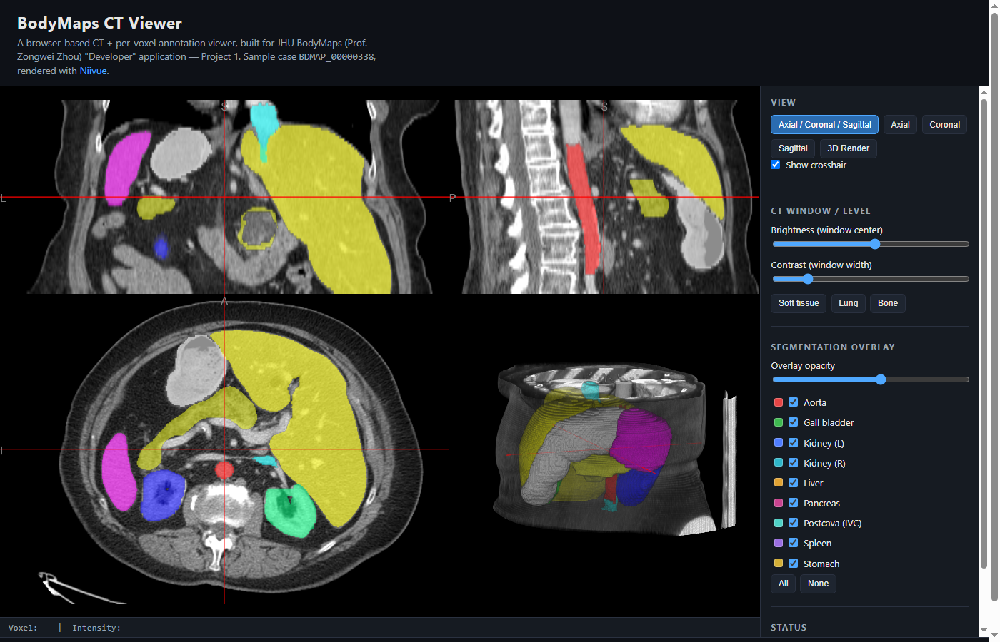

# BodyMaps CT Viewer

A browser-based CT scan + per-voxel segmentation viewer — built as an application
demo for the JHU BodyMaps **"Developer" volunteer position** (Project 1: web-based
CT viewer), for Prof. Zongwei Zhou's program.

**Live demo:** https://josephreggy23-coder.github.io/JHUdemo/



## Why this exists

The [call for developers](http://www.cs.jhu.edu/~zongwei/advert/Call4Developer.pdf) asks for:

> "...a web-based application that can visualize CT scans and per-voxel annotated
> structures, similar to 3D Slicer but can be used via a browser."

and asks applicants to demo a site that loads and visualizes the CT scan + masks
linked from the PDF. This repo is that demo: a working, self-contained viewer —
not a mockup — that loads a real CT volume and its organ segmentation masks and
renders them interactively, entirely in the browser.

## What it does

- **Multiplanar + 3D**: axial, coronal, and sagittal slices simultaneously, any
  single plane, or a full 3D volume render — one click to switch.
- **9 organ segmentations**, each independently toggleable and colored (aorta,
  gall bladder, left/right kidney, liver, pancreas, postcava, spleen, stomach),
  like segments in 3D Slicer.
- **CT window/level control** (brightness/contrast) with soft-tissue, lung, and
  bone presets, plus manual sliders.
- **Opacity control** for the segmentation overlay as a whole, and per-organ
  show/hide.
- **Live crosshair readout**: voxel coordinate and intensity (HU) under the
  cursor.

## Tech stack

- **[Niivue](https://github.com/niivue/niivue)** — an open-source WebGL2
  medical imaging renderer, loaded directly from a CDN as an ES module (no
  bundler, no `node_modules`). It understands NIfTI natively and handles slice
  rendering, volume rendering, colormaps, and windowing, which is what makes a
  browser-based "3D Slicer" feasible as a static site with no backend.
- Plain HTML/CSS/JS otherwise (`index.html`, `style.css`, `app.js`) — no
  framework, no build step.

## Data & credit

Sample CT scan and masks are the case linked from the JHU BodyMaps call for
developers PDF — a link only present as an embedded PDF annotation, not visible
in a plain-text extraction of the document:

<http://www.cs.jhu.edu/~zongwei/dataset/BDMAP_00000338.zip>

Case `BDMAP_00000338`: a CT volume (`ct.nii.gz`, 502×348×71 voxels) with 9 organ
segmentation masks, each its own single-label NIfTI file under
`data/segmentations/`. Credit to the
[JHU BodyMaps project](https://malonecenter.jhu.edu/projects/bodymaps/) (Malone
Center for Engineering in Healthcare) for the dataset. All files are committed
into this repo under `data/` so the demo is fully self-contained — no external
hosting, no CORS dependency.

## Run locally

Any static file server works, e.g.:

```bash
git clone https://github.com/josephreggy23-coder/JHUdemo.git
cd JHUdemo
python -m http.server 8000
# then open http://localhost:8000
```

It must be served over HTTP, not opened as a `file://` URL — browsers block
`fetch()` of local files under `file://`, which Niivue needs to load the NIfTI
volumes.

## Deploy

This is static HTML/JS/data, so GitHub Pages just works with zero build step —
this repo is deployed from the `main` branch root. To deploy your own fork:
Settings → Pages → Deploy from branch → `main` / `/`.

## License

Application code (`index.html`, `app.js`, `style.css`) is MIT-licensed — see
[LICENSE](LICENSE). The sample CT scan and segmentation masks under `data/`
are third-party JHU BodyMaps data and are not covered by that license.
